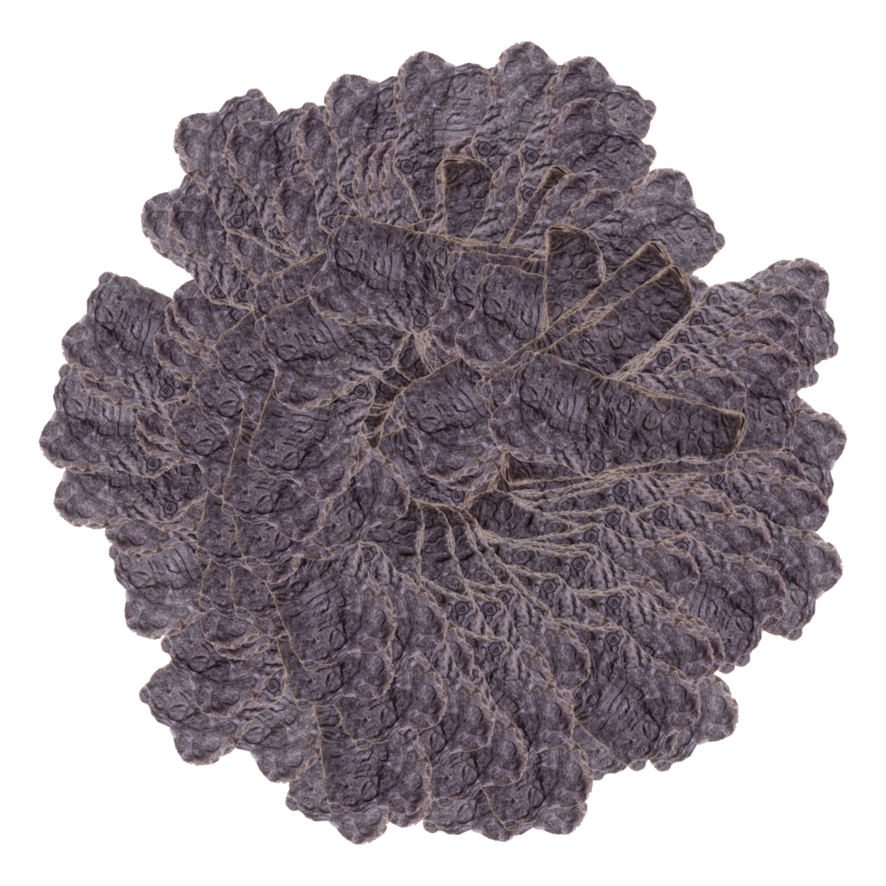

# sammlung-fotogalerie-im-rathaus

### grapholit-rotation
> I was given a photo of a rock by the Austrian artist Heinz Pöschko. The image showes an obscure looking black stone he called 'grapholit' - an artificial word to describe it's appearance. I looped over all pixels and freed the stone from it's white background. Then I translated in the center of a large white canvas and walked along the points of a circle, defined by the origin in the center and a constant radius. Every step I placed a rendition of the grapholith in an individually calculated angle and offset. What I get in the final output is a unique image every time I run the program.

*STATUS*

- [x] Code written out in Java
- [x] Generated final image in high resolution
- [x] Communicated image idea
- [ ] Status of acceptance
- [ ] Printed in format
- [ ] Controlling
- [ ] Framing
- [ ] Documentation text
- [ ] Social media preview assets
- [ ] Status ready

*PREVIEW*

### stripes

> Waiting gigantoraptor copy copy copy copy copy copy. How absurd can one be? With this program I'm slicing up a #photography into mere #abstraction of #colorful stripes. All details disappear and the #colors lerp slowly from one sample to the other, leaving only a vague impression of an image. Is it even #generativeart #graphicdesign #abstractart #drawing #doodle #sketch #processing #illustration #gradient #linearinterpolation

*STATUS*

- [x] Code written out in Java
- [ ] Final images
- [x] Communicated image idea
- [ ] Status of acceptance
- [ ] Printed in format
- [ ] Controlling
- [ ] Framing
- [ ] Documentation text
- [ ] Social media preview assets
- [ ] Status ready

### gridscapes

> The cross-divisional work grid-scapes combines methods from photography, computer science and graphic design. The aim of this connection is to create an independent aesthetic. The series starts with photographs of landscapes in the Styrian highlands. The further processing is to be understood as a darkroom in which is being developed. A grid is placed over the picture. In each cell, the algorithm measures the color at the center. The values for red, green and blue are visualized with a line. Length, line width and rotation of the line depend on the colors. The end product is an abstract line graphic which is the visualization of the data and equally the picture itself.

*STATUS*

- [x] Code
- [x] Final images
- [x] Communicated image
- [x] Status of acceptance
- [ ] Printed in format
- [ ] Controlling
- [ ] Framing
- [x] Documentation text
- [x] Social media preview assets
- [ ] Status ready

### reflections

> For me sometimes the reflection is far more present than the thing being reflected.

*STATUS*

- [x] Code written out in Python
- [x] Communicated image idea
- [ ] Final images
- [ ] Status of acceptance
- [ ] Printed in format
- [ ] Controlling
- [ ] Framing
- [ ] Documentation text
- [ ] Social media preview assets
- [ ] Status ready

### painterly

*STATUS*

- [x] Code written out in JavaScript
- [ ] Code translated to Python or Java
- [x] Communicated image idea
- [ ] Final images
- [ ] Status of acceptance
- [ ] Printed in format
- [ ] Controlling
- [ ] Framing
- [ ] Documentation text
- [ ] Social media preview assets
- [ ] Status ready

### Ideas

- [ ] Collage multiple low res images with p5-effects-min?
- [ ] Take example from genuary?
- [ ] Versionize the cDistShape sketch
- [ ] Use an analogue medium format black and white image for reflections?
- [ ] Flowfield & colormap
- [ ] Use a mirror?